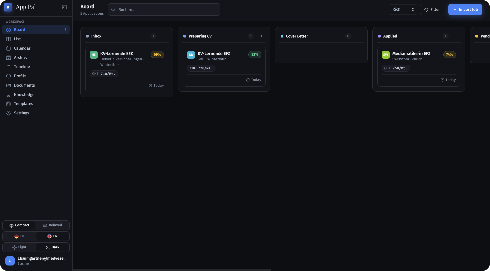
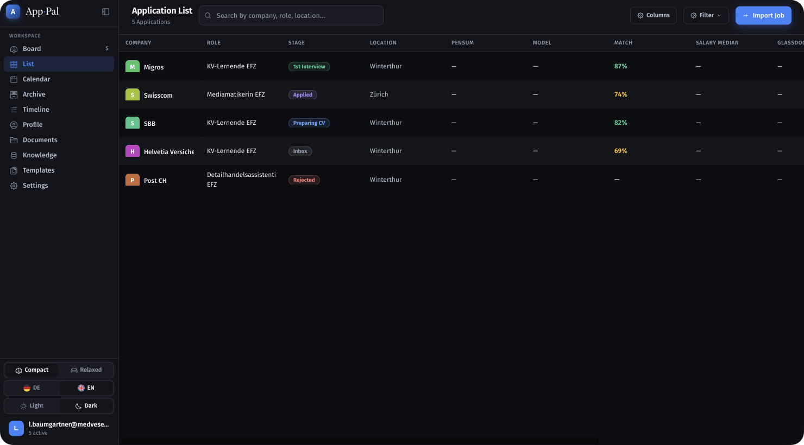
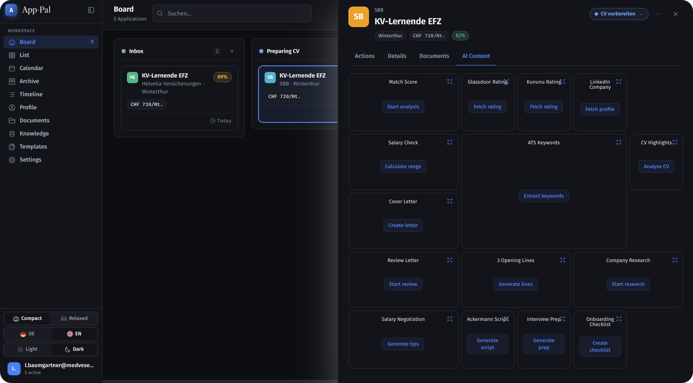
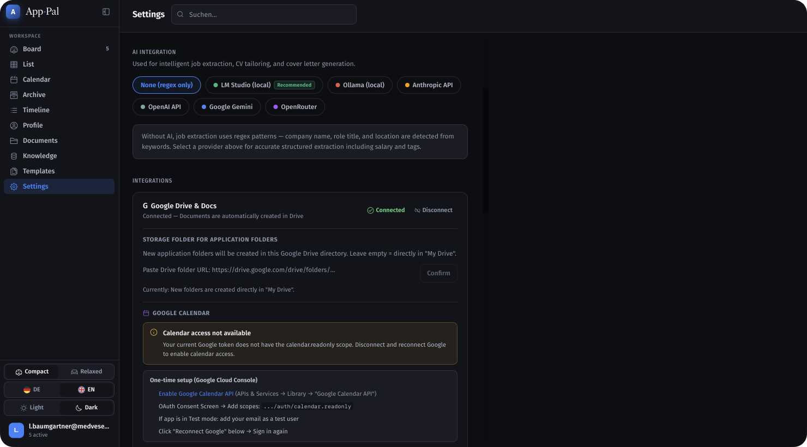
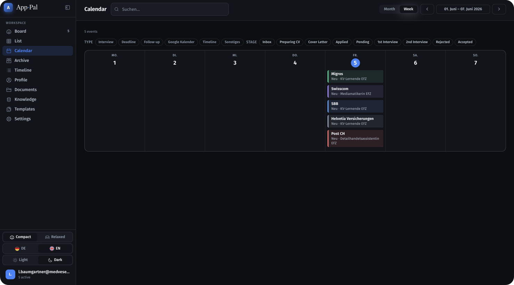

# Application Pal

Personal job application tracker with AI coaching. Runs entirely on your own machine via Docker — no cloud account, no subscription, your data stays with you.

---

## Screenshots

| Kanban Board | List View |
|---|---|
|  |  |

| AI Coaching | Google Drive |
|---|---|
|  |  |



---

## Initial Setup

### 1. Prerequisites

Install **[Docker Desktop](https://www.docker.com/products/docker-desktop/)** (Mac / Windows) or Docker + Docker Compose (Linux).

### 2. Download and start

```bash
curl -O https://raw.githubusercontent.com/Doebele/application-pal/main/docker-compose.release.yml
curl -O https://raw.githubusercontent.com/Doebele/application-pal/main/.env.example
cp .env.example .env
```

Open `.env` and change `POSTGRES_PASSWORD` to a secure value of your choice.

```bash
docker compose -f docker-compose.release.yml up -d
```

The first start takes about 1 minute while all services initialise.

### 3. Create your account

Open **http://localhost:8070** — the setup form guides you through creating your first account (e-mail + password).

### 4. Optional: Connect Google Drive

Google Drive lets the app automatically create a folder per application, copy your CV and cover-letter templates into it, and export AI-generated content as formatted Google Docs.

→ [docs/google-setup.md](docs/google-setup.md)

### 5. Optional: Enable AI features

AI is used for job import, match scoring, CV analysis, cover letters, interview prep, salary negotiation, and more. Six providers are supported — including free local options (LM Studio / Ollama) that require no internet connection.

→ [docs/ai-setup.md](docs/ai-setup.md)

### Update

```bash
docker compose -f docker-compose.release.yml pull
docker compose -f docker-compose.release.yml up -d
```

Your data is preserved (the PostgreSQL volume is not deleted).

---

## Views

### Board
Kanban board with drag & drop across all stages. Application cards show company, role, match score, tags, and number of days in the current stage.

### Table `/table`
Fully configurable table of all applications with AI metrics:
- **15 columns** — Company, Role, Stage, Location, Match, Salary Median, Glassdoor ★, Kununu ★, Salary (listing), Source, Tags, Applied, 1st Interview, Created, Updated
- **Column width** — drag the right edge of any column header to resize (persisted)
- **Column order** — drag & drop column headers to reorder
- **Show/hide columns** — ⚙ columns panel
- **Pin columns** — Pin L / Pin R for sticky columns on horizontal scroll
- **AI directly from the table** — every AI column (Match, Salary Median, Glassdoor, Kununu) has a ✦ icon to run and a ↺ icon to refresh
- **Horizontal scrolling** — all columns available without squeezing

### Calendar `/calendar`
Month and week view with interview, deadline, and follow-up events. Filter by stage and type; filter parameters are persisted in the URL.

### Profile `/profile`
- **Persona selection** — School leaver (apprenticeship/internship) · Career starter · Career changer
- Master CV, LinkedIn bio, and personal notes feed into all AI analyses
- Desired salary as a reference line in the salary chart
- Markdown preview for Master CV and notes

### Templates `/templates`
Google Doc template manager: any number of templates per AI content type, one active at a time. Create a new template → a fully formatted Google Doc with `{{PLACEHOLDER}}` variables is created in Drive.

---

## Application Drawer

Opens when you click on an application. Four tabs:

| Tab | Content |
|-----|---------|
| **Actions** | Stage checklist + AI action buttons + stage AI tiles + activity timeline |
| **Details** | Overview fields · Contacts · Notes · Job description (Markdown, preview/edit) |
| **Documents** | Google Drive folder · Copy templates · Live folder contents · Library |
| **AI Insights** | Match score ring + all 13 AI tiles (across all stages) |

### AI Tiles

Compact tiles in a grid. Each tile shows the most important metric; click opens the full-screen detail view.

| Stage | Tiles |
|-------|-------|
| Inbox | Glassdoor ★ · Kununu ★ · LinkedIn · Salary Check · ATS Keywords |
| CV | CV Highlights |
| Cover Letter | Cover Letter Review · Opening Sentences |
| Sent / Pending | Company Research · Salary Negotiation · Ackermann Script |
| Interview | Interview Preparation · Salary Negotiation |
| Accepted | Onboarding Checklist |

**Tile design:**
- Filled tiles use their application stage colour as a background tint
- Tile size depends on content: 1×1 (numbers), 2×1 (text), 3×2 (ATS keyword word cloud)
- Match score: ring chart with overall percentage; expand → bars + strengths / gaps / reasoning

### ATS Keywords Word Cloud

- `d3-cloud`-based layout (same algorithm as Poll Everywhere / Slido)
- Font size: Must Have → large · Nice to Have → medium · Soft Skills / Tools → small
- Font weight 200–800 proportional to size
- Condensed font for better density
- Expanded view: full-width cloud + 4-column category list with all keywords

### Interview Preparation (Expanded)

Full list of all generated questions with:
- Copy icon per question
- Accordion for 4 categories (Role-specific, Chris Voss, STAR examples, Questions to ask)
- "Export as Google Doc" (uses the active template from `/templates`)

### Ackermann Script (Expanded)

Salary negotiation from the **candidate's perspective** (seller model):
- Anchor offer ~125 % of target salary (anchor high, then approach in decreasing steps)
- Per round: amount + phrasing + tactic · copy button per phrasing
- Voss anchor phrasing with its own copy button
- "Export as Google Doc"

---

## AI Coaching

All AI results are saved with a timestamp to the database and restored the next time you open the drawer.

### AI Actions by Stage

**Inbox:**
- Glassdoor / Kununu rating (AI estimate + editable URL)
- LinkedIn company profile (headcount, URL)
- Swiss salary check (salary band min / median / max as a bar chart with desired-salary line)
- ATS keywords (Must-Have / Nice-to-Have / Soft Skills / Tools)

**CV stage:**
- CV highlights (relevant strengths, keywords, gaps)
- Google Doc from Master CV

**Cover letter stage:**
- Generate cover letter / export as Google Doc
- Review cover letter (tone, length, personalisation, clichés)
- 3 alternative opening sentences

**Applied / Pending:**
- Application email / follow-up email / LinkedIn connection message
- Company research (overview, culture, market position, competitors, current news)
- Ackermann negotiation script

**Interview:**
- Interview preparation (role-specific questions, STAR examples, Chris Voss method, questions to ask)
- Salary negotiation tips
- Google Calendar export / iCal download

**Closing:**
- Onboarding checklist (30/60/90 days)
- Thank-you email
- Rejection emails

### Google Doc Export

All larger AI outputs can be exported as Google Docs. With an active template from `/templates` the layout of the template is used — `{{PLACEHOLDERS}}` are replaced with the generated content while fonts and styles are preserved.

**Template folders in Google Drive:**
- `Pal-Templates/` — all Google Doc templates (auto-created)
- `Pal-PDFs/` — all uploaded PDFs (auto-created)

---

## Google Drive Integration

- Automatically create an application folder per job
- Copy templates from the master folder (style / formatting preserved via `files.copy`)
- Display live folder contents (loaded directly from Drive, not from a DB cache)
- Delete files individually (from Drive + DB)
- Configurable naming rules for folders and files (`{company}`, `{role}`, `{date}`, etc.)

---

## Documents

- **Global library** — CV, references, certificates, Figma links, portfolio (categorised)
- Assign library docs to an application → automatically copied to Drive (Docs) or uploaded (PDFs)
- `Drive ✓` badge after a successful copy

---

## Interview Appointment

- Date, time, duration, format (On-site / Video / Phone)
- Address / video URL / meeting code / provider (Zoom, Teams, Google Meet, Other)
- Interviewer names, notes
- Google Calendar export (URL method, optionally with a saved calendar ID)
- iCal download (`.ics`) for Apple Calendar, Outlook, etc.

---

## Profile & Settings

### Profile
- **Persona** — School leaver · Career starter · Career changer (influences AI prompts)
- Master CV with Markdown preview
- LinkedIn bio, personal notes
- Desired salary (reference line in salary chart)

### Settings
- AI provider: LM Studio · Ollama · Anthropic · OpenAI · Google Gemini · OpenRouter
- Dark / Light theme, accent colour (Indigo / Violet / Emerald / Amber / Rose)
- Card style (compact / standard / detailed / editorial)
- Session timeout (15 min to 30 days)
- Google Drive naming rules
- Google Calendar ID

---

## Authentication

- E-mail / password (bcrypt), Google Sign-In, Passkeys (Apple Face ID / Touch ID / Windows Hello)
- "Stay signed in" — session cookie (expires on close) or 90-day persistent cookie
- Configurable session timeout
- Password recovery via e-mail OTP
- JWT in httpOnly cookies (no localStorage)

---

## Multi-User

Multiple users can share the same instance — data is fully isolated per `user_id`. Invite-based registration: an existing user generates an invite link.

Shared-token fallback for Google Drive: one admin connects Google once; other users can use the same account or connect their own.

---

## Installation

### Prerequisites

- [Docker Desktop](https://www.docker.com/products/docker-desktop/) (Mac / Windows) or Docker + Docker Compose (Linux)

### Quick Start

```bash
curl -O https://raw.githubusercontent.com/Doebele/application-pal/main/docker-compose.release.yml
curl -O https://raw.githubusercontent.com/Doebele/application-pal/main/.env.example
cp .env.example .env
# Open .env → change POSTGRES_PASSWORD
docker compose -f docker-compose.release.yml up -d
```

The first start takes about 1 minute until all services are ready.  
Open **http://localhost:8070** — the setup form guides you through the first registration.

### Update

```bash
docker compose -f docker-compose.release.yml pull
docker compose -f docker-compose.release.yml up -d
```

Data is preserved (the PostgreSQL volume is not deleted).

---

## Optional Features

| Feature | Guide |
|---------|-------|
| Google Drive & Sign-In | [docs/google-setup.md](docs/google-setup.md) |
| AI (LM Studio / Ollama / Anthropic / …) | [docs/ai-setup.md](docs/ai-setup.md) |
| Data backup & migration | [docs/backup.md](docs/backup.md) |

---

## AI Configuration

Six providers are supported. Configure under **Settings → AI Integration**:


| Provider | Type | Requirement |
|----------|------|-------------|
| **LM Studio** ★ | Local | Install [lmstudio.ai](https://lmstudio.ai), load a model (Qwen3 8B+) |
| **Ollama** | Local | Install [ollama.ai](https://ollama.ai), run `ollama pull qwen3:8b` |
| **Anthropic** | Cloud | API key from [console.anthropic.com](https://console.anthropic.com) |
| **OpenAI** | Cloud | API key from [platform.openai.com](https://platform.openai.com) |
| **Google Gemini** | Cloud | API key from [aistudio.google.com](https://aistudio.google.com) (free tier) |
| **OpenRouter** | Cloud | API key from [openrouter.ai](https://openrouter.ai) (200+ models) |

→ Full guide: [docs/ai-setup.md](docs/ai-setup.md)

All AI features are optional — without configuration the app runs as a pure management tool.

---

## Developer Setup

```bash
git clone https://github.com/Doebele/application-pal.git
cd application-pal
cp .env.example .env
docker compose build && docker compose up -d
```

Local development (hot reload):
```bash
npm install
npm run dev --workspace frontend   # http://localhost:5174
npm run dev --workspace backend    # http://localhost:3000
```

```bash
npm run typecheck --workspace frontend
npm run typecheck --workspace backend
npm run build --workspace shared   # after schema changes
```

Technical overview: [CLAUDE.md](CLAUDE.md)

---

## Tech Stack

| Layer | Technology |
|-------|-----------|
| Frontend | React 19 + Vite, TanStack Query, TanStack Table, Zustand, React Router |
| Backend | Hono.js (Bun/Node), Drizzle ORM |
| Database | PostgreSQL 16 |
| AI | LM Studio · Ollama (local) / Anthropic · OpenAI · Gemini · OpenRouter (cloud) |
| Drive | Google Drive API v3 + Docs API |
| Auth | JWT (httpOnly cookie), bcrypt, WebAuthn (@simplewebauthn) |
| Fonts | Fira Sans · Libre Caslon Text · Fira Mono |
| Icons | Iconoir |
| Deployment | Docker Compose |

---

## Ports

| Service | Port |
|---------|------|
| Frontend (nginx) | 8070 |
| Backend (Hono API) | 8071 |
| PostgreSQL | 15436 |

---

## Security

- All data stored locally in PostgreSQL — no cloud sync
- Login with e-mail / password, Google OAuth, or Passkey (WebAuthn / FIDO2)
- JWT tokens in httpOnly cookies (no localStorage)
- Multi-user with full data isolation per `user_id`

---

## License

MIT
