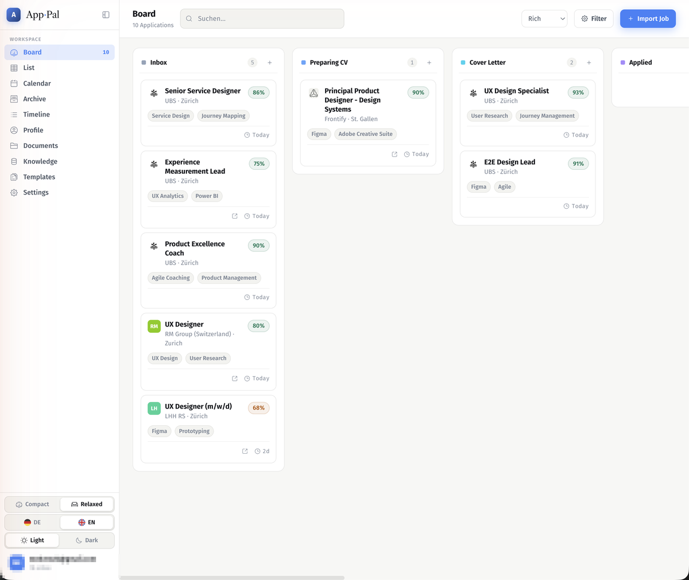
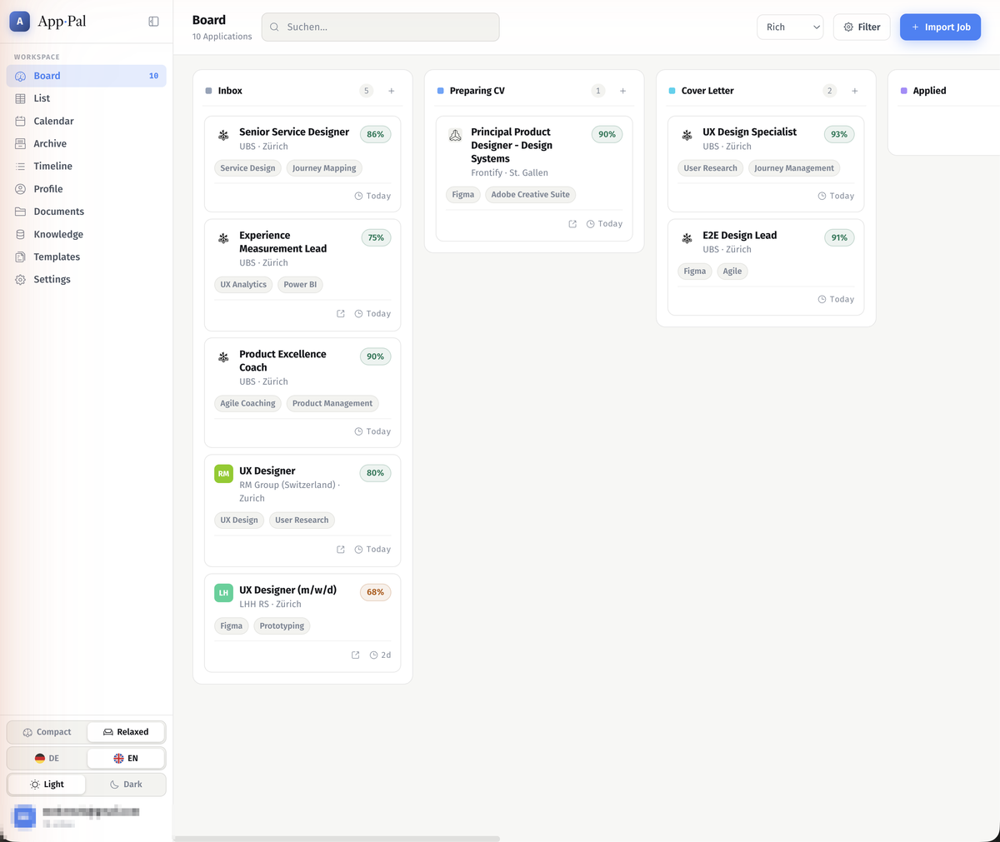

# KI-Integration einrichten

Application Pal nutzt KI für:

- **Job-Import** — strukturierte Extraktion von Firma, Rolle, Ort, Gehalt und Tags aus einer Job-URL
- **Match-Score** — Bewertung wie gut dein Profil zur Stelle passt (0–100 mit Breakdown)
- **CV-Highlights** — welche Erfahrungen besonders relevant für die Stelle sind
- **Anschreiben** — personalisierten Entwurf generieren (optional als Google Doc)
- **Email-Entwürfe** — Bewerbungs-, Follow-up- oder Absage-Email vorformulieren
- **Interview-Vorbereitung** — Rollenspezifische Fragen, STAR-Beispiele, Chris-Voss-Methode, Rückfragen
- **Gehaltsverhandlung** — Markteinschätzung, Taktiken, Ackermann-Script
- **Unternehmensrecherche** — Überblick, Kultur, Marktposition, Wettbewerber

Alle KI-Funktionen sind **optional** — ohne Konfiguration läuft die App als reines Verwaltungswerkzeug.

---

## Übersicht der Anbieter

| Anbieter | Typ | Kosten | Empfehlung |
|----------|-----|--------|-----------|
| **LM Studio** ★ | Lokal | Kostenlos | Beste Privatsphäre, läuft ohne Internet |
| **Ollama** | Lokal | Kostenlos | Leichtgewichtig, viele Modelle |
| **Anthropic** | Cloud | ~$0.01–0.05 / Analyse | Sehr hohe Qualität |
| **OpenAI** | Cloud | ~$0.01–0.05 / Analyse | GPT-4o-Modelle |
| **Google Gemini** | Cloud | Gratis-Tier vorhanden | Schnell, grosses Kontextfenster |
| **OpenRouter** | Cloud | Variiert | Zugang zu 200+ Modellen |

Der Anbieter wird in **Einstellungen → KI-Integration** konfiguriert:



---

## Option A — LM Studio ★ (empfohlen für lokale Nutzung)

LM Studio lässt dich leistungsstarke KI-Modelle direkt auf deinem Rechner betreiben. Keine Cloud, keine Kosten, volle Privatsphäre.

### 1. LM Studio installieren

Download: **[lmstudio.ai](https://lmstudio.ai)** (Mac, Windows, Linux)

### 2. Modell herunterladen

In LM Studio: **Discover → Suche "Qwen3"**

| Modell | Grösse | Qualität | Empfohlen für |
|--------|--------|----------|--------------|
| `Qwen3-8B` | ~5 GB | Gut | 16 GB RAM |
| `Qwen3-14B` | ~9 GB | Sehr gut | 24 GB RAM |
| `Qwen3-30B-A3B` (MoE) | ~20 GB | Ausgezeichnet | 32+ GB RAM |

> **Hinweis zu Qwen3:** Das Modell gibt zuerst einen `<think>…</think>`-Block aus. Application Pal entfernt diesen automatisch vor der Verarbeitung.

### 3. Server starten

In LM Studio: **Developer → Start Server** (Standard-Port: 1234)

### 4. In Application Pal konfigurieren

**Einstellungen → KI-Integration → LM Studio (lokal)**

- **URL:** `http://localhost:1234` (Standard)
- **Modell:** wird automatisch aus dem Server geladen — im Dropdown auswählen

Klicke auf das ↺-Icon neben der URL um die Verbindung zu testen. Ein grüner Haken ✓ bestätigt den Erfolg.

> LM Studio muss laufen wenn du einen Job importierst oder einen Match-Score berechnst.

---

## Option B — Ollama (leichtgewichtig, lokal)

Ollama ist eine schlanke Alternative zu LM Studio mit derselben Privatsphäre.



### 1. Ollama installieren

Download: **[ollama.ai](https://ollama.ai)** (Mac, Windows, Linux)

Oder per Terminal:

```bash
# macOS / Linux
curl -fsSL https://ollama.ai/install.sh | sh

# macOS (Homebrew)
brew install ollama
```

### 2. Modell herunterladen

```bash
# Empfohlen: gute Qualität/Geschwindigkeit
ollama pull qwen3:8b        # ~5 GB, 16 GB RAM
ollama pull llama3.2        # ~2 GB, schnell
ollama pull mistral         # ~4 GB, gut für europäische Sprachen

# Ollama-Server starten (läuft automatisch nach Installation)
ollama serve
```

### 3. In Application Pal konfigurieren

**Einstellungen → KI-Integration → Ollama (lokal)**

- **URL:** `http://localhost:11434` (Standard)
- **Modell:** wird automatisch aus dem lokalen Ollama geladen

Klicke ↺ um die Verbindung zu testen — verfügbare Modelle erscheinen im Dropdown.

---

## Option C — Anthropic Claude (Cloud)

Hochwertige Cloud-KI. Verwendet intern Claude Haiku für Kosteneffizienz.

### 1. API-Key erstellen

1. Anmelden unter **[console.anthropic.com](https://console.anthropic.com)**
2. **API Keys → Create Key**
3. Key kopieren (wird nur einmal angezeigt)
4. Credits aufladen (Kreditkarte erforderlich)

### 2. In Application Pal konfigurieren

**Einstellungen → KI-Integration → Anthropic API**

- **API Key:** `sk-ant-api03-…`

Kosten: ca. **$0.01–0.05 pro Analyse** (Claude Haiku)

---

## Option D — OpenAI (Cloud)

GPT-4o und weitere OpenAI-Modelle.

### 1. API-Key erstellen

1. Anmelden unter **[platform.openai.com](https://platform.openai.com)**
2. **API Keys → Create new secret key**
3. Key kopieren, Credits aufladen

### 2. In Application Pal konfigurieren

**Einstellungen → KI-Integration → OpenAI API**

- **API Key:** `sk-proj-…`
- **Modell:** `gpt-4o-mini` (Empfehlung) · `gpt-4o` · `gpt-4-turbo` · `gpt-3.5-turbo`

Kosten: ca. **$0.01–0.03 pro Analyse** (gpt-4o-mini)

---

## Option E — Google Gemini (Cloud)

Googles Gemini-Modelle mit grossem Kontextfenster und kostenlosem Tier.

### 1. API-Key erstellen

1. Öffne **[aistudio.google.com](https://aistudio.google.com)**
2. **Get API key → Create API key**
3. Key kopieren (kein Kreditkartenkonto erforderlich für Gratis-Tier)

### 2. In Application Pal konfigurieren

**Einstellungen → KI-Integration → Google Gemini**

- **API Key:** `AIza…`
- **Modell:** `gemini-2.0-flash` (Empfehlung) · `gemini-2.0-flash-lite` · `gemini-1.5-pro`

Kosten: **Gratis-Tier** verfügbar (60 Anfragen/Minute); kostenpflichtig bei hohem Volumen.

---

## Option F — OpenRouter (Cloud, 200+ Modelle)

OpenRouter bündelt Hunderte von KI-Modellen unter einer einzigen API — Claude, GPT-4o, Llama, Mistral, Gemini und viele mehr.

### 1. Account & API-Key

1. Anmelden unter **[openrouter.ai](https://openrouter.ai)**
2. **Keys → Create Key**
3. Credits aufladen
4. Key kopieren

### 2. In Application Pal konfigurieren

**Einstellungen → KI-Integration → OpenRouter**

- **API Key:** `sk-or-v1-…`
- **Modell:** freies Textfeld — beliebiges Modell aus [openrouter.ai/models](https://openrouter.ai/models)

Empfehlungen:

| Modell | Notizen |
|--------|---------|
| `anthropic/claude-haiku-4-5` | Schnell & günstig |
| `openai/gpt-4o-mini` | Verbreitet, günstig |
| `meta-llama/llama-3.3-70b-instruct` | Oft kostenlos (limitiert) |
| `google/gemini-2.0-flash-001` | Schnell, grosses Kontext |
| `qwen/qwen3-235b-a22b` | Open-Source, sehr stark |

---

## Ohne KI

Ohne KI-Konfiguration:

- **Job-Import** funktioniert per Regex (Firma, Rolle, Ort werden aus Keywords erkannt — weniger präzise)
- **Match-Score, CV-Highlights, Anschreiben, Email-Entwürfe, Interview-Vorbereitung** nicht verfügbar
- **Board, Tabelle, Kalender, Google Drive, Dokumente, Kontakte** funktionieren vollständig

---

## Datenschutz

| Anbieter | Verarbeitung |
|----------|-------------|
| LM Studio | Nur auf deinem Rechner — keine Cloud |
| Ollama | Nur auf deinem Rechner — keine Cloud |
| Anthropic | Anthropic-Server |
| OpenAI | OpenAI-Server (USA) |
| Google Gemini | Google-Server |
| OpenRouter | OpenRouter → weiterleitung an gewählten Anbieter |

Für maximale Privatsphäre: **LM Studio** oder **Ollama** wählen.
